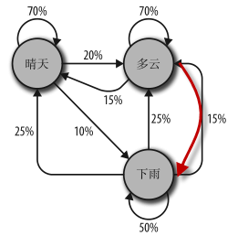

基于一种常用于分析大量随机事件的马尔可夫模型，随机事件的特点
是一个离散事件发生之后，另一个离散事件将在前一个事件的条件下以一定的概率发生。

#### 马尔可夫模型描述的理论天气系统
在这个天气系统模型中，如果今天是晴天，那么明天有 70% 的可能是晴天，20% 的可能多云，10% 的可能下雨。如果今天是下雨天，那么明天有 50% 的可能也下雨，25% 的可能是晴天，25% 的可能是多云。  

#### 需要注意以下几点
- 任何一个节点引出的所有可能的总和必须等于 100%。无论是多么复杂的系统，必然会在下一步发生若干事件中的一个事件。
- 虽然这个天气系统在任一时间都只有三种可能，** 但是你可以用这个模型生成一个天气状态的无限次转移列表。** 
- 只有当前节点的状态会影响后一天的状态。如果你在“晴天”节点上，即使前 100 天都是晴天或雨天都没关系，明天晴天的概率还是 70%。
- 有些节点可能比其他节点较难到达。这个现象的原因用数学来解释非常复杂，但是可以直观地看出，在这个系统中任意时间节点上，第二天是“雨天”的可能性（指向它的箭头概率之和小于“100%”）比“晴天”或“多云”要小很多。
